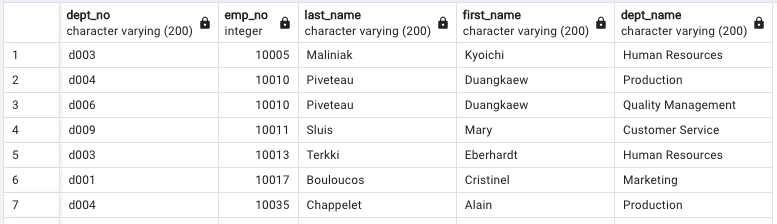
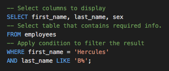

# 
 <ins>SQL-Challenge<ins/>

## <ins>Background<ins/>
It’s been two weeks since I have been hired as a new data engineer at Pewlett Hackard (a fictional company). My first major task was to do a research project about people whom the company employed during the 1980s and 1990s. All that remained of the employee database from that period were six CSV files.

This project is divided into three parts: data modeling, data engineering, and data analysis.

## <ins>Data Modeling<ins/>

This is where I inspected all six CSV files, and then sketched an Entity Relationship Diagram (ERD) of the tables. To create the sketch, I used a tool called 'QuickDBD'. I produced a Physical data model, showing the many to one and one to one relationships. 

## <ins>Data Engineering<ins/>
The above information was exported to create a table schema for each of the six CSV files, where I specified the data types, primary keys, foreign keys, and other constraints, as seen in [schema](EmployeeSQL/SQL_files/Schema_edit.sql) file.

After doing the above, I had: 
- Created the database in PostgreSQL
- Imported the schema into the database
- Ran each part to create the tables within the database
- Imported the following CSV files into the corresponding SQL table
     * departments
     * dept_emp
     * dept_manager
     * employees
     * salaries
     * titles
     

## <ins>Data Analysis<ins/>

1. List the employee number, last name, first name, sex, and salary of each employee.

2. List the first name, last name, and hire date for the employees who were hired in 1986.

3. List the manager of each department along with their department number, department name, employee number, last name, and first name.

4. List the department number for each employee along with that employee’s employee number, last name, first name, and department name.

5. List first name, last name, and sex of each employee whose first name is Hercules and whose last name begins with the letter B.

6. List each employee in the Sales department, including their employee number, last name, and first name.

7. List each employee in the Sales and Development departments, including their employee number, last name, first name, and department name.

8. List the frequency counts, in descending order, of all the employee last names (that is, how many employees share each last name).

